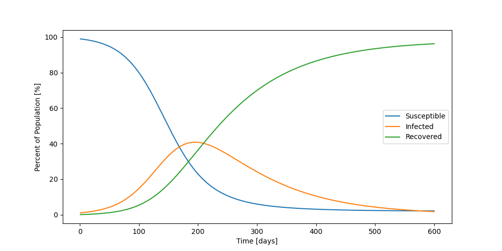

= The Pandemic Simulation
Chad Gilbert
:stem: latexmath

Here we walk though simulating a pandemic. In the sections that follow, I will
describe different ways of considering how an infectious disease can propagate
through a population. 

== Analysis Pipeline

To see the pipeline that supports this analysis, look link:map/index.html[here].

== The Susceptible, Infected, Recovered (SIR) Model

In this first model, we'll imagine that a new virus appears to which the entire
population (stem:[N]) is susceptible. The number of susceptible people
(stem:[S]) decreases as they become infected. For a spatially mixed population,
the likelihood of a susceptible person encountering an infectious person is
proportional to stem:[S I / N]. For now, consider stem:[\beta] to just be a
scalar rate of infection. Once someone recovers from the infection, they are
deemed no longer to be susceptible to the virus. We will count the number of
people who are recovered, stem:[R]. Let stem:[\gamma] be the rate at which
infected people recover from the virus.

This model give the equations:

[latexmath%number#number]
++++
\frac{dS}{dt} = -\frac{\beta I S}{N} \\

\frac{dI}{dt} = \frac{\beta I S}{N} - \gamma I \\

R' = \gamma I \\

S + I + R = N \\
++++

For simplicity, we solve this using Euler's method.

.An image

