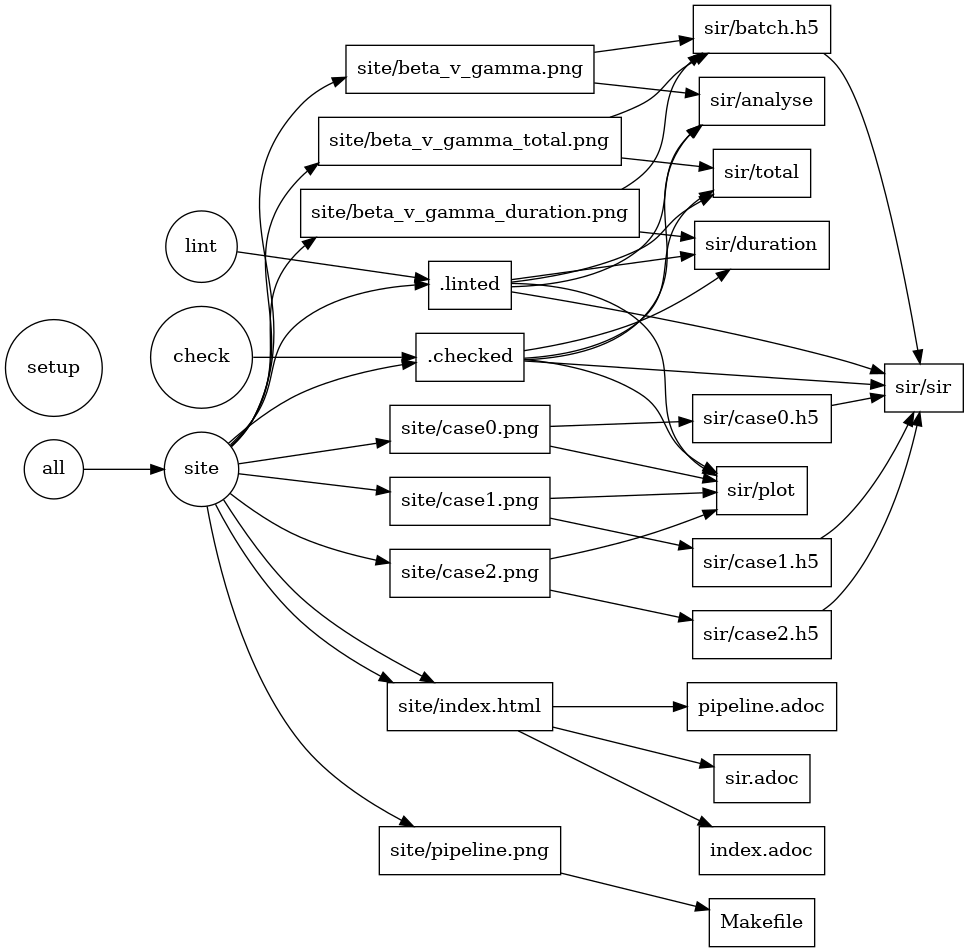

It is possible to just write a single program or script to run the entire
analysis at one time. Though this is workable, many anlayses, this one included,
produce lots of intermediate outputs, and can take a while to run. It would be
nice not to have to re-run parts of the anlaysis unless we have to. On the other
hand, it would go against the principle of reproducibility to have a human just
run parts of the analysis because that re-introduces the possibility that they
will take a wrong step and get a non-reproducible result.

Luckily, `make` is designed to solve exactly this problem and it is available on
almost all systems. A `Makefile` can be written to describe the recipe for 
creating each intermediate output of the analysis, and to describe all of the
dependencies that afftect them. This can be used to describe the entire analysis
workflow, as in the following image.

.The analysis pipeline for this project.

Make compares time stamps of all the files and automatically determines which
steps of the anlaysis have to be re-run and which can be skipped. In addition to
speeding up re-analysis when a file is changed, the Makfile is a very useful
reference to help understand how each file in the repository contributes to the
anlaysis.

The pipeline dependency graph above itself is generated from the `Makefile` in
this project as part of the analysis. This is done automatically using the
python program `makefile2dot` and Graphviz.
