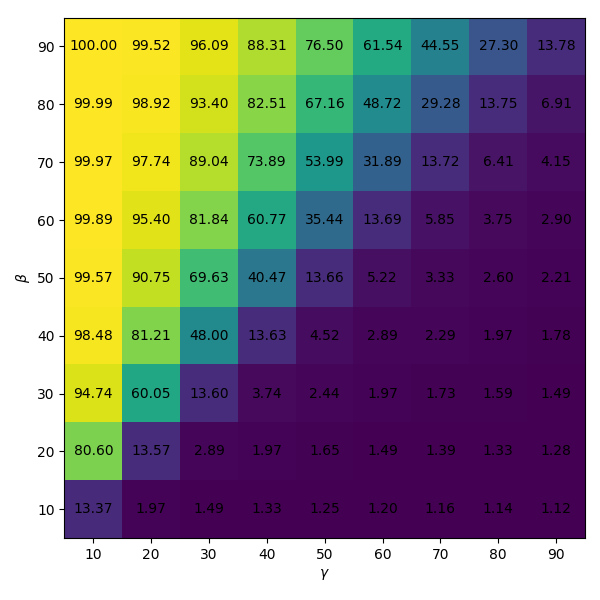
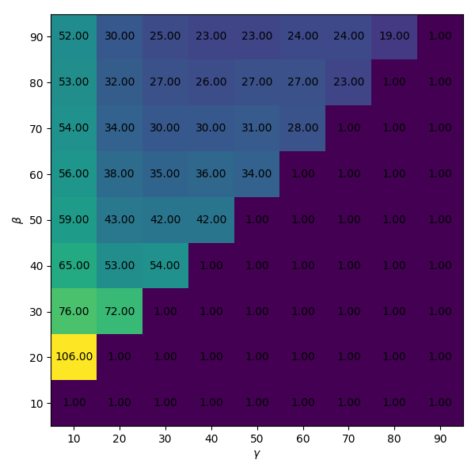

The first model idealizes a disease like measles, mumps or rubella, in which
people who have recovered from it maintain immunity for the rest of their
life.

Let stem:[S] be a real number in the range stem:[\[0,1\]] representing the
proportion of the population
that is susceptible to the disease. They are healthy and have no immunity
against the disease. In this model, we will assume that all people in the
population are equally likely to get the disease and none of them are immune to
it.

Let stem:[I] be a real number in the range stem:[\[0, 1\]] representing the
propotion of the population
that is currently infected with the disease.

Let stem:[R] be a real number in the range stem:[\[0, 1\]] representing the
proportion of the population
that has recovered from the disease. These people are no lnger contagious,
meaning they can no longer get anyone else sick, and they are immune to the
disease, so they can't get it again.

The the rates at which people transition from susceptible (stem:[S]) to
infected (stem:[I]) to recovered (stem:[R]) is described by the following
equations:

[latexmath]
++++
\frac{dS}{dt} = -\beta I S \\
\frac{dI}{dt} = \beta I S - \gamma I \\
\frac{dR}{dt} = \gamma I
++++

where stem:[S + I + R = 1].

In this analysis, we will start by assuming that stem:[\beta] and stem:[\gamma]
are constant. Note that stem:[\beta] and stem:[\gamma] have dimension of inverse
time. So stem:[\beta] can be thought of as the rate at which infected
people infect susceptible people, and stem:[\gamma] as the rate at which
infected people recover.

=== Basic Dynamics

The basic dynamics of the S-I-R model are easy to understand. Imagine a
population shortly after the introduction of a new disease where at time
stem:[t = 0], stem:[1\%] of the population has been infected and stem:[99\%] are
still susceptible.

Since the rate of infection is proportional to the number of suscteptible people
and the number of infected people, the number of infected people increases
itself at an increasing rate. As people recover and become immune, the numbers
both of infected and susceptible people are reduced, and therefore the rate of
new infections that appear also begins to shrink.

How quick the spread and how many people get infected depend on the values of
both stem:[\beta] and stem:[\gamma]. If it clear that if stem:[\gamma < \beta],
there will not be a pandemic, because the number of infections will immediately
begin shrinking. To illustrate this, first consider the horrible case where
stem:[\gamma = 0] so we can see what happens when nobody recovers.

<<sir_case_0,{figure-caption} {counter:refnum}>> shows the dynamic where
stem:[\beta = 0.05] and stem:[\gamma = 0.00]. Since nobody ever recovers, the
rate of increase of infected people is identical to the rate of decrease of the
number of susceptible people. Both follow a logistic curve.

[#sir_case_0]
[title=' - stem:[\beta = 0.05] and stem:[\gamma = 0.00]']
image::case0.png[caption='{figure-caption} {counter:refnum}']

<<sir_case_1,{figure-caption} {counter:refnum}>> shows the dynamic for
stem:[\beta = 0.04] and stem:[\gamma = 0.01]. The portion of the population with
the infection increases early on and then levels out after 180 days. At day 180,
stem:[42\%] of the population has the disease. At this point, with more people
recovering and becoming immune, the rate at which new recoveries occur becomes
greater than the rate at which new infection occur. After more than a year,
almost everyone in the population will have been infected at some point.

[#sir_case_1]
[title=' - stem:[\beta = 0.04] and stem:[\gamma = 0.01]']
image::case1.png[caption='{figure-caption} {counter:refnum}']

<<sir_case_2,{figure-caption} {counter:refnum}>> shows the dynamic for
stem:[\beta = 0.08] and stem:[\gamma = 0.04]. This time the portion of
simultaneously infected people peaks earlier after about 100 days, with
stem:[17 \%] of the population sick at the same time. In the limit, about
stem:[80 \%] of the population will have been infected at some point.

[#sir_case_2]
[title=' - stem:[\beta = 0.08] and stem:[\gamma = 0.04]']
image::case2.png[caption='{figure-caption} {counter:refnum}']

At this point it should be pretty clear, both from mathematical analysis of the
equations, and from a superficial analysis of the individual simulations in
cases 0 through 2, that the stem:[\beta] and stem:[\gamma] control:

  1. the portion of the population that becomes sick simultaneously; and
  2. the portion of the population the gets sick eventually;
  3. the duration of the pandemic.

The the sections that follow, we compare the effects of different stem:[\beta]
and stem:[\gamma] on these key measures.

=== The Flatness of the Curve

During news coverage on COVID-19, there has been lots of talk about "flattening
the curve". Remembering that the only purpose of this document is to use a very
simplistic model as a toy to demonstrate how to create reproducible simulations
and analyses, not as an attempt to make any recommendations about or even
provide insight into the present pandemic, it is nonetheless clear why we should
want to look at the portion of the population who become infected at the same
time. Too many simultaneous infections puts an excessive load on the systems
that care for the infected people who fall ill.

Simulations were run for every combination of stem:[\beta] in stem:[{0.01, 0.02,
0.03, 0.04, 0.05, 0.06, 0.07, 0.08, 0.09}] and stem:[\gamma] in stem:[{0.01,
0.02, 0.03, 0.04, 0.05, 0.06, 0.07, 0.08. 0.09}]. For each combination, the
maximum value of stem:[I] is reported in <<sir_max_simultaneous_infections,
{figure-caption} {counter:refnum}>>.

[#sir_max_simultaneous_infections]
[title=' - the maximum percentage of simultaneous infections for combinations of stem:[\beta] and stem:[\gamma].']
image::beta_v_gamma.png[caption='{figure-caption} {counter:refnum}', align="center"]

For all cases when stem:[\gamma] is less than stem:[\beta], the maximum value is
stem:[0.01], or 1%. This is because the portion of infections was started at
stem:[I = 0], and immediately began to decrease. The approximate trend is that
as the ratio stem:[\beta / \gamma] increases, so does the number of
simultaneous infections. Interestingly, different stem:[\beta] and stem:[\gamma]
still have similar values for the peak. For example, for stem:[\beta = 0.02] and
stem:[\gamma = 0.01], the peak is 16%, and for stem:[\beta = 0.04] and
stem:[\gamma = 0.02], the peaks is also 16%.

=== Total Number of Infections

There is also the question of how many people must become infected to achieve
"herd immunity". Will everyone get sick? Or how many will be spared of the
illness once enough have recovered and developed immunity?

From the same simulations in the previous section, we can measure the total
number of people having been infected. These are shown in
<<sir_max_total_infections, {figure-caption} {counter:refnum}>>. Perhaps
unsurprisingly, the relationship is similar.

[#sir_max_total_infections]
[title=' - the maximum percentage of total infections for combinations of stem:[\beta] and stem:[\gamma].']

=== Speed

[#sir_duration]
[title=' - the duration of the pandemic for combinations of stem:[\beta] and stem:[\gamma].']

